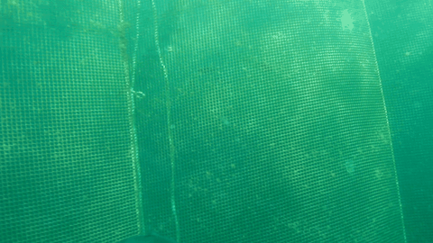
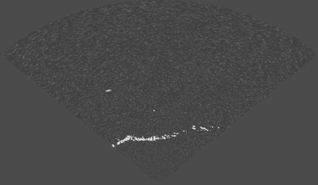

# SOLAQUA-annotated

**Alternative download:** [huggingface.co/datasets/bangkorkor/solaqua-annotated](https://huggingface.co/datasets/bangkorkor/solaqua-annotated)

<p align="center">
  
  
</p>

Annotated dataset for object detection and multi-object tracking (MOT) of fish and net structures in aquaculture net pens. Contains synchronized vision (monocular camera) and sonar (Ping 360) data collected from an ROV at a commercial salmon farm on 20 August 2024.

Raw data provided by [SINTEF Ocean](https://data.sintef.no/feature/fe-a8f86232-5107-495e-a3dd-a86460eebef6). Part of a master's thesis — full experiment code at [bangkorkor/aquaculture-perception](https://github.com/bangkorkor/aquaculture-perception).

---

## Detection Subset

YOLO format. Each image has a paired `.txt` label file: one line per instance as `class_id cx cy w h` (normalized).

**Vision** — class: `fish`

| Split | Images | Fish instances |
|-------|--------|---------------|
| Train | 505 | 2 101 |
| Val | 124 | 465 |
| Test | 164 | 587 |
| **Total** | **793** | **3 153** |

59 of 793 images are background (no fish). The remaining 734 contain at least one fish instance.

**Sonar** — classes: `fish`, `net`

| Split | Images | Total instances | Fish instances |
|-------|--------|-----------------|---------------|
| Train | 1 336 | 1 973 | 637 |
| Val | 400 | 541 | 141 |
| Test | 400 | 565 | 165 |
| **Total** | **2 136** | **3 079** | **943** |

Every sonar image contains exactly one net instance. Fish are present in 546 (25.6%) of sonar images.

---

## MOT Subset

Five time-synchronized sequences. Each sequence has vision and sonar frames with persistent track-identity annotations. Sonar sequences also include one net track per sequence. Sequences are provided as complete runs without pre-defined splits.

MOT-sequence format (CVAT export): one annotation line per object per frame:

```
frame_index, track_id, x, y, w, h, is_valid, class_id, visibility
```

`x, y` are top-left pixel coordinates; `w, h` are pixel dimensions; `visibility` is 1.0 for all instances. Class names are in `labels.txt`. Track IDs are consistent within a modality but not across modalities.

| Seq. | Duration (s) | Vision frames | Sonar frames | Vision fish annots | Sonar fish annots | GT tracks (vision/sonar) |
|------|-------------|---------------|--------------|-------------------|-------------------|--------------------------|
| 14-31-29 | 67.8 | 1 500 | 1 060 | 4 967 | 946 | 53 / 30 |
| 17-34-52 | 40.1 | 644 | 623 | 1 783 | 1 075 | 63 / 35 |
| 17-39-32 | 39.1 | 625 | 607 | 500 | 246 | 24 / 13 |
| 17-40-54 | 63.9 | 1 018 | 994 | 1 595 | 603 | 60 / 28 |
| 17-55-40 | 50.1 | 796 | 781 | 1 667 | 780 | 65 / 24 |
| **Total** | **261.0** | **4 583** | **4 065** | **10 512** | **3 650** | **265 / 130** |

---

## Getting Started

> **Recommended:** Download from [HuggingFace](https://huggingface.co/datasets/bangkorkor/solaqua-annotated) — faster and more reliable than cloning this repo.

**Clone** (alternative)

```bash
git clone https://github.com/bangkorkor/solaqua-annotated.git
cd solaqua-annotated
```

**Training and evaluation with Ultralytics**

The detection subset is in standard YOLO format and works directly with [Ultralytics](https://github.com/ultralytics/ultralytics). Create a dataset YAML pointing at `dataset/detection/vision` or `dataset/detection/sonar` and use the Ultralytics CLI or Python API to train and evaluate.

**Contributing annotations**

The MOT ground-truth annotations were created in [CVAT](https://www.cvat.ai). CVAT-format exports are included alongside each sequence in `gt_CVAT/`. To extend or correct annotations, import the existing `gt_CVAT/` archive into a CVAT task, make edits, and export back to MOT format to replace `gt/gt.txt`.

**Working with raw data**

The raw ROV recordings (ROS bags) are available at the SINTEF archive linked above. Processing pipelines for extracting frames from the bags and building dataset splits are provided in the master project at [bangkorkor/aquaculture-perception](https://github.com/bangkorkor/aquaculture-perception).

---

## License

[MIT](LICENSE)
